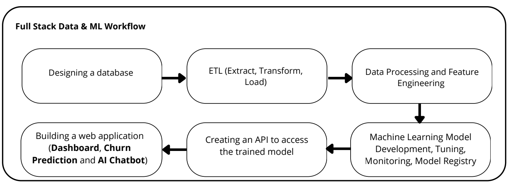
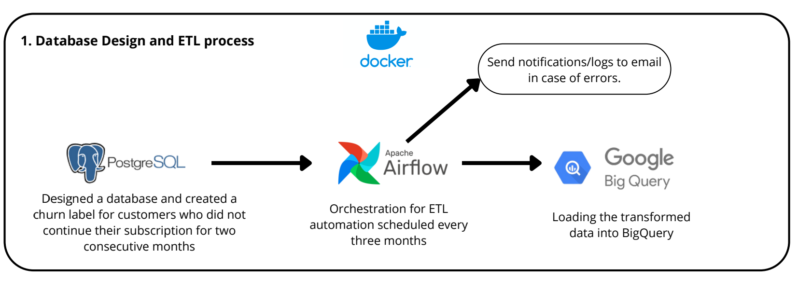
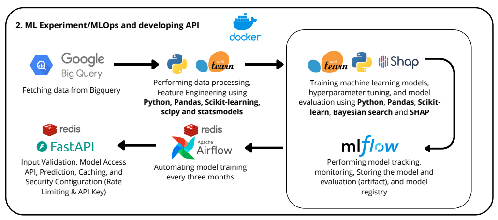
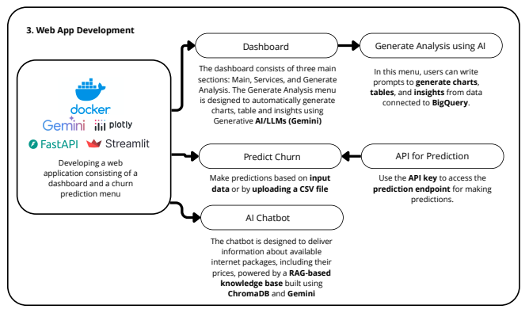

# 📡 Full Stack Data Science & AI Project for the telecommunications industry


---

## 🔥 Overview

Project ini dibuat untuk **mensimulasikan Full Stack Data Science dan AI** pada domain **Industri telekomunikasi**, mulai dari:

* Membangun database dan Data Warehouse
* ETL
* Churn Prediction and Analysis:
   * Exploratory Data Analysis
   * Data Preprocessing & Feature Engineering
   * Machine Learning (XGBoost) + Hyperparameter tuning using Bayesian Search Optimization
   * Explainable AI (SHAP)
* MLOps
* Otomatisasi ETL dan MLOps
* API untuk inference
* Web App:
  *   Dashboard dan Otomatisasi Pembuatan Chart dan Insight dengan LLM/Generative AI
  *   Prediksi Churn berdasarkan input manual dan file CSV
  *   AI Chatbot dengan RAG untuk memberikan informasi paket internet dan harganya. 

Dataset utama berasal dari [Kaggle](https://www.kaggle.com/code/sardiirfansyah/customer-churn-prediction-analysis), kemudian ditambah dengan beberapa tabel dummy untuk menyerupai kondisi real industri telekomunikasi.

---

## 🧩  Workflow Diagram








---

# 🚀 Features Summary

| Bagian                                     | Deskripsi                                                                                                                                                                                                                                                                                                                                                                                                                                                | Tech Stack / Tools                              |
| ------------------------------------------ | -------------------------------------------------------------------------------------------------------------------------------------------------------------------------------------------------------------------------------------------------------------------------------------------------------------------------------------------------------------------------------------------------------------------------------------------------------- | ----------------------------------------------- |
| **Database Design (RDBMS)**                        | - Mendesain schema database Telco (customer, contract and internet service, transaction) <br> - Membuat *view churn* dengan aturan: **pelanggan dianggap churn jika tidak melakukan pembayaran selama ≥ 2 bulan** <br>                                                                                                                                                        | Docker, PostgreSQL                                 |
| **ETL Pipeline**                           | - Extract data dari PostgreSQL <br> - Transform: join tabel, cleaning, data quality check, pengayaan fitur (tenure, payment delay, service type) <br> - Load ke BigQuery sebagai Data Warehouse <br> - Dirancang modular & reusable                                                                                                                                                                                                                      | Python, pandas, BigQuery, PostgreSQL              |
| **Data Warehouse**                         | - Mengintegrasikan dataset Kaggle dengan data hasil ETL PostgreSQL <br> - Membuat data mart atau tabel untuk keperluan ML & dashboard analitik                                                             | BigQuery                                        |
| **Orkestrasi (Otomatisasi & Penjadwalan)** | - ETL dijalankan otomatis **setiap 3 bulan** <br> - Setelah ETL selesai, sistem otomatis melakukan: <br> → Preprocessing <br> → Training machine learning model + Hyperparameter tuning <br> → Evaluasi dan promosikan model ke Production (jika **recall** >= 0.8 dan **F1-Score**>=0.6) <br> - Menjalankan pipeline ML end-to-end secara otomatis                                                                                                                         | Airflow, Bash, Python                    |
| **EDA & Machine Learning (Jupyter Notebook)**                 | - Analisis churn: distribusi, service usage, contract terms, billing patterns, tenure, etc. <br> - Preprocessing pipeline: cleaning, encoding, scaling, feature engineering. <br> - Model training menggunakan **XGBoost** <br> - Hyperparameter Tuning: **Bayesian Optimization** + Grid Search <br> - Evaluasi model: precision, recall, F1, Custom Metric <br> - **Explainable AI**: **SHAP**, Permutation Feature Importance | Python, scikit-learn, XGBoost, SHAP, pandas, matplotlib, seaborn, plotly, scipy, numy, statsmodels |
| **MLOps**                                  | - Script otomatis untuk preprocessing, training, tuning, evaluasi <br> - ML model tracking: metrics, parameters, artifacts <br> - Model registry (staging → production) <br> - Automatic promotion jika model baru lebih baik <br> - Monitoring & reproducibility                                                                                                                                                                                        | MLflow, Airflow, Docker, Scikit-learn, SHAP, Python, XGBoost                          |
| **Model Serving/API Development**                          | - FastAPI untuk model inference <br> - Mendukung prediksi: **single input** & **batch CSV** <br> - **Caching** untuk response lebih cepat <br> - **API key** untuk keamanan <br> - **Rate limiting** untuk membatasi penggunaan <br> - Logging request & error handling                                                                                                                                                                                  | FastAPI, Uvicorn, Redis (opsional caching)      |
| **Web App**                                | - **Dashboard** analitik churn, layanan, kontrak, billing, tenure <br> - Halaman **Churn Prediction** (manual input & CSV via API) <br> - **AI Chatbot** untuk informasi paket internet, harga, rekomendasi layanan                                                                                                                                                                                                                                          | Streamlit, Plotly, FastAPI                      |
| **GenAI Integration**                      | - Menampilkan **chart otomatis**, tabel, dan insight menggunakan **Gemini LLM** <br> - Menghasilkan analisis dataset secara otomatis tanpa query manual <br> - Membantu interpretasi data & anomaly explanation                                                                                                                                                                                                                                          | Gemini API (Generative AI), Python              |
| **AI Chatbot with RAG**                | - Knowledge base chatbot disimpan di **ChromaDB** <br> - Menggunakan embedding untuk pencarian dokumen <br> - Chatbot memberi jawaban yang relevan berdasarkan konteks layanan Telco <br> - Mendukung history & memory                                                                                                                                                                                                                                   | ChromaDB, LLM with Gemini                     |
---

## 📓 Explore Notebooks

Semua **analisis data & model machine learning** untuk proyek ini tersedia di folder `notebooks/`.
Namun, untuk pengalaman **interaktif dan visualisasi penuh**, saya merekomendasikan untuk membuka notebook di **Kaggle**:

🔗 [Customer Churn Prediction & Analysis Notebook](https://www.kaggle.com/code/sardiirfansyah/customer-churn-prediction-analysis)

---

### ✨ Kenapa membuka di Kaggle?

* Notebook sudah **didesain dengan HTML & CSS** agar lebih menarik dan interaktif.
* Semua **chart, tabel, dan insight** bisa dilihat secara lengkap.
* Mendukung **scrolling interaktif** untuk eksplorasi data dan model.
* Mudah dijalankan kembali jika ingin bereksperimen atau mengubah parameter model.

---

### 💡 Tips:

* Jika membuka di GitHub, notebook akan terlihat **plain** karena styling HTML/CSS tidak sepenuhnya tampil.
* Untuk pengalaman terbaik, buka di Kaggle agar **dashboard, visualisasi interaktif, dan layout rapi** bisa dinikmati.

---

# 📦 Installation & Setup

Ikuti langkah berikut untuk menjalankan proyek **Full Stack Data Science & AI Telco** menggunakan Docker.

---

## 1️⃣ Clone Repository

```bash
git clone https://github.com/username/nama-repo.git
cd nama-repo
```

---

## 2️⃣ Install python dependencies

Untuk menjalakan scripts awal dalam pembuatan tabel atau dataset di BigQuery dan juga jupyter notebook, jalankanlah perintah berikut:
```
pip install -r requirements.txt
```
**catatan**: File `requirements.txt` berada pada root folder dan folder notebooks. 

## 3️⃣ Install Docker & Docker Compose

Pastikan Anda sudah menginstall:

* **Docker Engine atau Docker Desktop**


## 4️⃣ Konfigurasi File `.env`

Duplikat file .env contoh:

```bash
cp .env.example .env
```

Lalu isi variabel environment sesuai kebutuhan.

### Isi `.env` dengan informasi berikut:

#### 🔑 1. Google Cloud Access Key

Anda harus mendownload **Service Account JSON Key** untuk akses BigQuery & GCP.

* Masuk ke Google Cloud Console
* IAM & Admin → Service Accounts
* Create Key → JSON
* Simpan file, contoh: `gcp-service-key.json` ke folder root proyek Anda, folder `db` dan `web_app`
* Masukkan path di `.env` yang ada root folder:

```
GCP_CREDENTIALS=/opt/project/gcp_service_key.json
```

---

#### 📧 2. App Password untuk Email

Digunakan untuk notifikasi otomatis (opsional).

* Gmail → Manage Account
* Security → App Passwords
* Generate 1 password
* Masukkan:

```
EMAIL_HOST=smtp.gmail.com
EMAIL_PORT=587
EMAIL_USER=youremail@gmail.com
EMAIL_PASS=your_app_password
```

---

#### 🤖 3. Gemini API Key

Untuk fitur **Generative AI** (chart otomatis, insight, chatbot).

Dapatkan dari:
[https://aistudio.google.com/app/apikey](https://aistudio.google.com/app/apikey)

Isi variabel di `.env` yang ada di folder `web_app`:
```
GEMINI_API_KEY=your_gemini_key
```

> Sesuaikan variabel lain sesuai kebutuhan Anda.

---

## 4️⃣ Jalankan Script untuk Pembuatan Database dan tabel di BigQuery

Sebelum menjalankan docker compose, jalankanlah script berikut untuk membuat db dan table di BigQuery. 

Copy file `gcp_service_key.json` ke folder `db` dan  jalankan script `create_db_bigquery.py`.

## 5️⃣ Jalankan Backend (ETL, MLOps, API, Database)

Berikut versi yang sudah **dirapikan, lebih rapi, dan mudah dibaca** untuk bagian menjalankan backend di README:

---

## 5️⃣ Jalankan Backend (ETL, MLOps, API, Database)

Proyek ini memiliki beberapa layanan backend utama:
**Airflow, MLflow, PostgreSQL, FastAPI, dll.**

1. Jalankan Docker Backend

    ```bash
    docker compose -f docker-compose.yml up -d --build
    ```
2. Akses Airflow

    Buka browser:

    ```
    http://localhost:8080
    ```

    * Masukkan **username & password** sesuai dengan file `.env`.
    * Cobalah untuk trigger ETL, training ML model, dan promosi model ke Production.

3. Akses MLflow

    Buka browser:

    ```
    http://localhost:5000
    ```

    * Masukkan **username & password** sesuai `.env`.
    * Anda dapat:

        * Melihat **hasil evaluasi model**
        * Memeriksa **model yang sudah yang sudah di training dan apakah model dipromosikan ke Production**

---

4. Setup API Key untuk FastAPI

    - Masuk ke folder `fastapi_app/auth` dan Jalankan script:

        ```bash
        python create_key.py
        ```

    - Salin **API key** yang dihasilkan ke file `.env` di folder `web_app`:

        ```
        API_KEY_FASTAPI=your_generated_key
        ```

> Setelah ini, API FastAPI siap digunakan untuk inference dan batch prediction.

---


## 5️⃣ Jalankan Frontend (Dashboard, Prediction App, Chatbot)

Frontend (Streamlit / WebApp) berada pada file terpisah, sehingga anda harus menjalankan docker compose dengan nama file `docker-compose-frontend.yml`.:

```bash
docker compose -f docker-compose-frontend.yml up -d --build
```

Bukalah link streamlit:
```
http://localhost:8501
```
---

